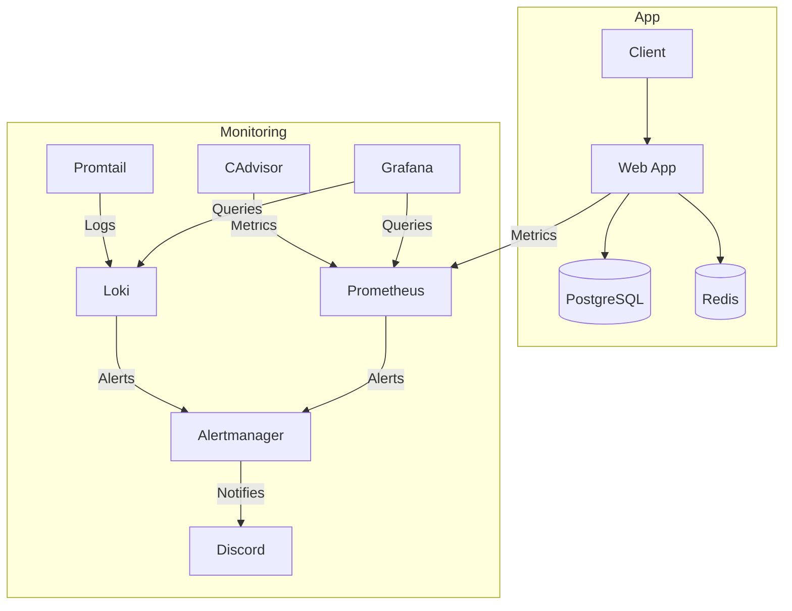

# Architecture Diagram

This document illustrates the system architecture of Project Lazarus, as defined in the `docker-compose.yml` file.

## System Overview

The application follows a microservices-inspired architecture with a strong emphasis on observability.

## Component Details

- **Web App (Flask)**: The core service handling URL shortening, redirection, and user management.
- **PostgreSQL**: Primary persistent storage for URL mappings and user data.
- **Redis**: High-performance caching layer to reduce database load.
- **Prometheus**: Time-series database for collecting and storing metrics.
- **Grafana**: Visualization platform for monitoring system health and golden signals.
- **Loki & Promtail**: Log aggregation system for centralized logging.
- **cAdvisor**: Monitors resource usage (CPU, Memory, I/O) of all running containers.
- **Alertmanager**: Handles alerts triggered by Prometheus/Loki and routes them to Discord.
